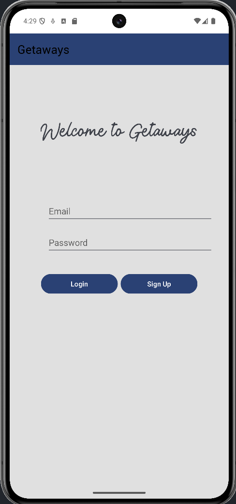
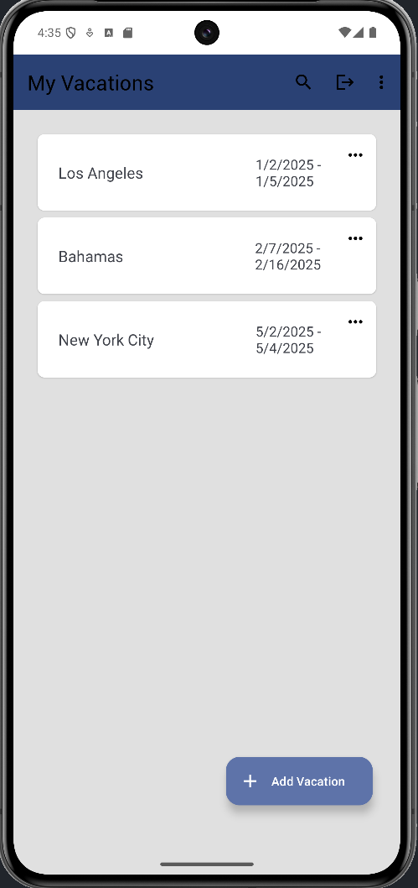
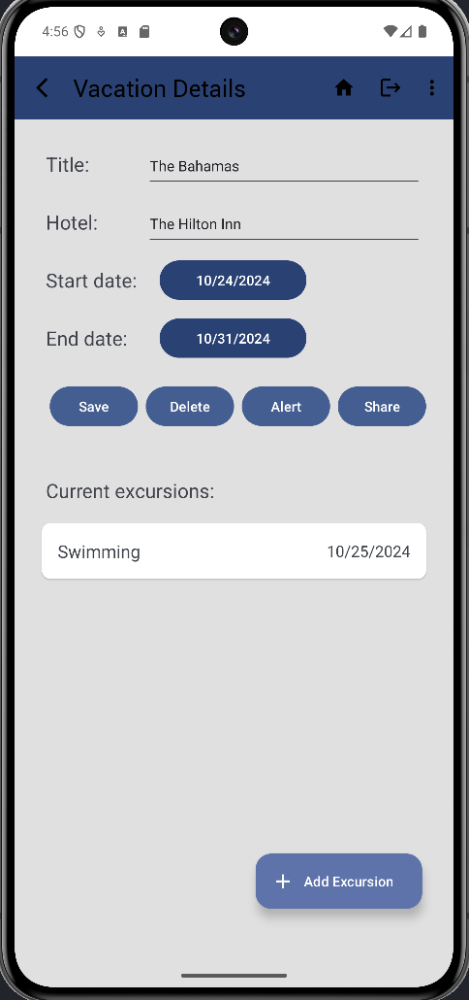
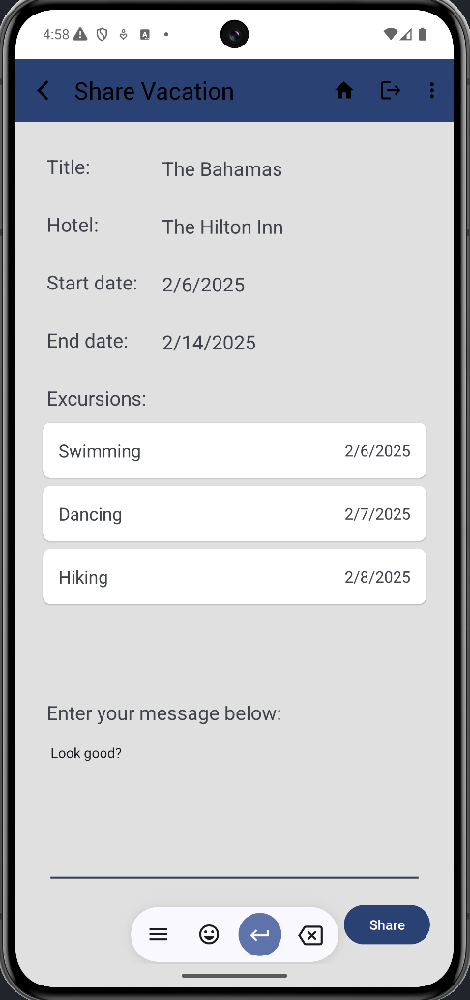

-Title:
Getaways

-Purpose:
This app is a vacation tracker that allows a user to add a vacation with a title,
hotel name, start and end dates, and excursions with their own details such as title and date

-Android version APK is deployed to:
Android Version: 14, SDK Version: 34

-Link to gitlab repository: *** Working branch
https://gitlab.com/wgu-gitlab-environment/student-repos/hkeays/d308-mobile-application-development-android.git

-Directions for how to operate the application and reach all the rubric aspects:

Add/update a vacation:
On the Vacation List page, the user can click on previously saved vacations or press the floating
action + button to add a new vacation. If the user clicked on a previously saved vacation, the
vacation's details will automatically populate the fields for editing if needed. If the user pressed
the floating action button, the fields will be empty and must be filled out. The title and hotel
name fields must be completed, and start and end dates must be selected. The start date must be in
the future, and it must come before the end date. Once all the information is filled in and valid,
clicking the save button will save or update the vacation.

-Delete a vacation:
On the Vacation List screen, the user can click on a previously saved vacation. The app will
navigate to the Vacation Details page, where a user can click the delete button to delete the
vacation. The vacation must not have any associated excursions. See 'Delete an excursion' below for
instructions on deleting excursions.

-Add/update an excursion:
On the Vacation Details page, the user can click on previously saved excursions or press the
floating action + button to add a new excursion. If the user clicked on a previously saved
excursion, its details will automatically populate the fields for editing if needed. If the user
pressed the floating action button, the fields will be empty and must be filled out. The title field
and date must be entered, and the date must fall between the start and end dates of the associated
vacation.

-Delete an excursion:
On the Vacation Details page, a list of associated excursions is shown below the vacation details.
By clicking on an excursion, the app will navigate to the Excursion Details page, where a user can
click the delete button to delete the excursion.

-Set an alert for a vacation:
By clicking the alert button on the Vacation Details page, the app will navigate to the Vacation
Alert screen, where the details are shown for review. The vacation must first be saved. To set the
alert, the user can click on the Set Alert button. Permissions for alerts and exact alarms will be
shown to the user for acceptance otherwise, notifications will not be set.

-Set an alert for an excursion:
By clicking the alert button on the Excursion Details page, the app will navigate to the Excursion
Alert screen, where the details are shown for review. The excursion must first be saved. To set the
alert, the user can click on the Set Alert button. Permissions for alerts and exact alarms will be
shown to the user for acceptance otherwise, notifications will not be set.

-Share a vacation:
By clicking on the share button on the Vacation Details page, the app will navigate to the Share
screen, where a user can review the vacation details and enter a custom message. The vacation must
first be saved. After entering their message, the user can press the share button. Options for
sending the message will appear, allowing the user to choose an app to send the message or email.
The email will automatically populate with all the vacation details, as well as the associated
excursions and their dates, along with the user’s message. The user can then enter the recipients
and send the message.